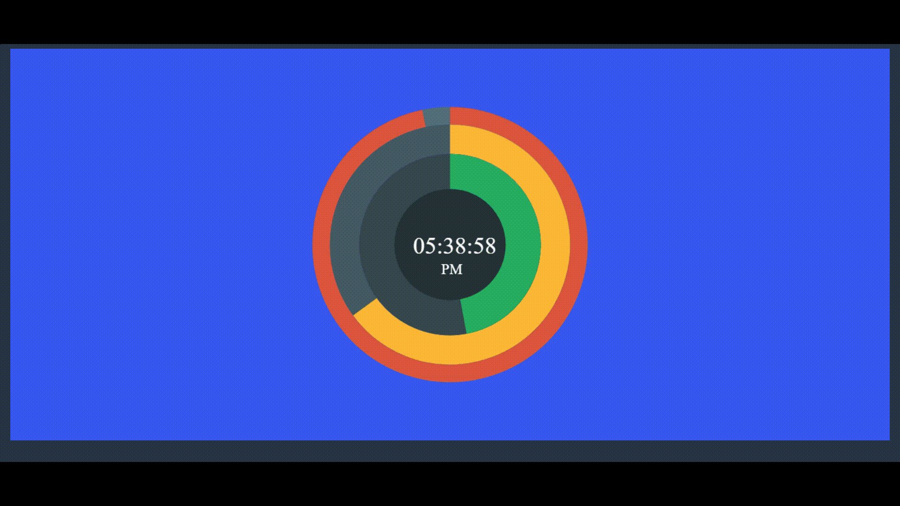

# HTML5 Canvas Clock

---

> _HTML5 provides us with the Canvas API which can be used to draw graphics on a browser using Javascript. We can start drawing graphics in the browser by just adding a canvas tag in HTML. It is similar to the real canvas that we use to paint. We can draw various shapes and texts and animate them using Javascript._

---

### 👉 [Demo](https://jackworld99.github.io/HTML5-Canvas-Clock/clock.html "Show clock.html")
